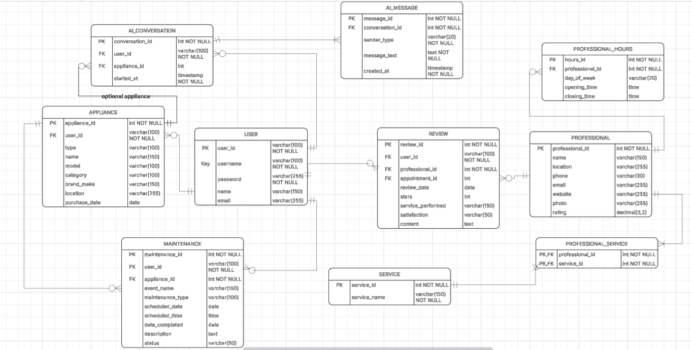

# IS401_Module5_GroupProject
# README

## App summary:

This is a website that will help homeowners track and maintain their household appliances. This is aimed to help homeowners who are too busy to do maintenance themselves or unsure of how to maintain the appliances themselves. It should eliminate the uncertainty of when, how, and who to help maintain and repair these appliances. The user should be able to log their appliances, future maintenance times, get help from an AI chatbot, and find professionals that can help with their maintenance. In addition, they should be able to leave reviews about the quality of the professionals and see reviews left by other users.

## ERD:

## Tech stack:

Frontend: HTML, CSS, and JavaScript

Backend: Supabase services

Database: Supabase Postgres database

**Why:** This stack fits our team because we are most familiar with it. We chose HTML, JavaScript, and Supabase because they allow us to build an interactive application quickly with minimal infrastructure. Also it is all free

## Vertical slice:

## How to Get It Running

1. Make sure Git and Visual Studio Code are installed on your computer.

2. Clone the GitHub repository to your computer:
   https://github.com/ayshae145/IS401_Module5_GroupProject.git